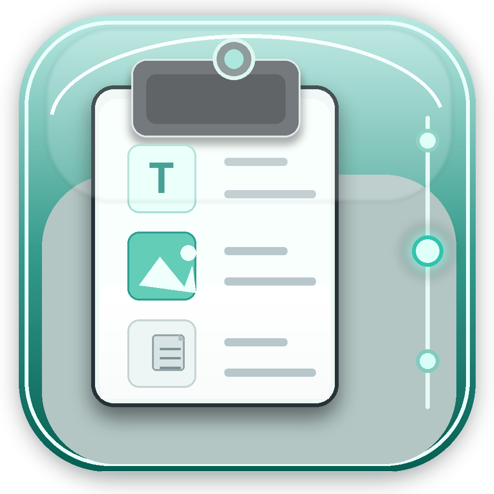

<p align="center">
  
</p>

# ClipLy

ClipLy is a lightweight macOS clipboard history app for text, images, and files. It runs from the menu bar and gives you a Spotlight-style launcher for quickly finding and pasting previous clipboard items.

## Features

- Clipboard history for text, images, files, and mixed clipboard contents
- Spotlight-style launcher
- Keyboard navigation with arrows and Enter
- Escape to close the launcher
- Configurable global keyboard shortcut
- Configurable retention from 1 day to 1 month
- Launch at login option
- Optional Dock icon
- Local SQLite-backed storage
- No analytics and no network service dependency

## Install

### Homebrew

```bash
brew tap rohitjavvadi/cliply
brew install --cask cliply
```

One-line install:

```bash
brew install --cask rohitjavvadi/cliply/cliply
```

### GitHub Release

Download `ClipLy.dmg` from the latest release:

https://github.com/rohitjavvadi/ClipLy/releases

Open the DMG, then drag `ClipLy.app` into Applications.

## Updating

If you installed with Homebrew:

```bash
brew update
brew upgrade --cask cliply
```

If you installed with a DMG, download the latest `ClipLy.dmg`, quit ClipLy, then drag the new `ClipLy.app` into Applications and choose Replace.

## Uninstall

If you installed with Homebrew and want to remove the app only:

```bash
brew uninstall --cask cliply
```

If you installed with Homebrew and want to remove the app plus stored ClipLy data:

```bash
brew uninstall --cask --zap cliply
```

If you installed manually, drag `ClipLy.app` from Applications to Trash. To also remove stored data manually:

```bash
rm -rf ~/Library/Application\ Support/ClipLy
defaults delete app.cliply.ClipLy 2>/dev/null || true
```

You can also remove app data from inside ClipLy:

1. Open ClipLy Settings
2. Click `Delete All ClipLy Data…`
3. Confirm `Delete and Quit`

## Permissions

ClipLy may ask for Accessibility permission. This is used to paste the selected clipboard history item into the app you are currently using.

To enable it manually:

1. Open System Settings
2. Go to Privacy & Security
3. Open Accessibility
4. Enable ClipLy

## Privacy

ClipLy stores clipboard history locally on your Mac.

Default data location:

```text
~/Library/Application Support/ClipLy
```

ClipLy does not use analytics. Clipboard history is not sent to a server by the app.

## Build From Source

Requirements:

- macOS
- Xcode

Build:

```bash
xcodebuild -project ClipboardHistory.xcodeproj -scheme ClipboardHistory -configuration Debug build
```

The built app is created by Xcode under DerivedData as `ClipLy.app`.

## Homebrew Tap

The Homebrew tap lives here:

https://github.com/rohitjavvadi/homebrew-cliply

## License

ClipLy is released under the MIT License. See [LICENSE](LICENSE).
